# 🛍️ EasyShop - Modern E-commerce Platform

[](https://nextjs.org/)
[](https://www.typescriptlang.org/)
[](https://www.mongodb.com/)
[](https://redux.js.org/)
[](LICENSE)

EasyShop is a modern, full-stack e-commerce platform built with Next.js 14, TypeScript, and MongoDB. It features a beautiful UI with Tailwind CSS, secure authentication, real-time cart updates, and a seamless shopping experience.

## ✨ Features

- 🎨 Modern and responsive UI with dark mode support
- 🔐 Secure JWT-based authentication
- 🛒 Real-time cart management with Redux
- 📱 Mobile-first design approach
- 🔍 Advanced product search and filtering
- 💳 Secure checkout process
- 📦 Multiple product categories
- 👤 User profiles and order history
- 🌙 Dark/Light theme support

## 🏗️ Architecture

EasyShop follows a three-tier architecture pattern:

### 1. Presentation Tier (Frontend)
- Next.js React Components
- Redux for State Management
- Tailwind CSS for Styling
- Client-side Routing
- Responsive UI Components


### 2. Application Tier (Backend)
- Next.js API Routes
- Business Logic
- Authentication & Authorization
- Request Validation
- Error Handling
- Data Processing

### 3. Data Tier (Database)
- MongoDB Database
- Mongoose ODM
- Data Models
- CRUD Operations
- Data Validation

## PreRequisites

> [!IMPORTANT]  
> Before you begin setting up this project, make sure the following tools are installed and configured properly on your system:

## Setup & Initialization <br/>

### 1. Install Terraform
* Install Terraform<br/>
#### Linux & macOS
```bash
curl -fsSL https://apt.releases.hashicorp.com/gpg | sudo apt-key add -
sudo apt-add-repository "deb [arch=amd64] https://apt.releases.hashicorp.com $(lsb_release -cs) main"
sudo apt-get update && sudo apt-get install terraform
```
### Verify Installation
```bash
terraform -v
```
### Initialize Terraform
```bash
terraform init
```
### 2. Install AWS CLI
AWS CLI (Command Line Interface) allows you to interact with AWS services directly from the command line.

```bash
curl "https://awscli.amazonaws.com/awscli-exe-linux-x86_64.zip" -o "awscliv2.zip"
sudo apt install unzip
unzip awscliv2.zip
sudo ./aws/install
```
###  Install AWS CLI in Windows 'powershell'
```msiexec.exe /i https://awscli.amazonaws.com/AWSCLIV2.msi```


 ```aws configure```


> #### This will prompt you to enter:<br/>
- **AWS Access Key ID:**<br/>
- **AWS Secret Access Key:**<br/>
- **Default region name:**<br/>
- **Default output format:**<br/>

> [!NOTE] 
> Make sure the IAM user you're using has the necessary permissions. You’ll need an AWS IAM Role with programmatic access enabled, along with the Access Key and Secret Key.

## Getting Started

> Follow the steps below to get your infrastructure up and running using Terraform:<br/>

0 ssl /tls

# Deploying a Secure Nginx Website on AWS

This guide explains how to deploy an **Nginx web server** on an **EC2 instance** behind a **Load Balancer**, configure **Route 53 DNS**, and secure the website with an **SSL/TLS certificate** from AWS Certificate Manager (ACM).

---

## Steps

### 0.1 Launch EC2 Instance
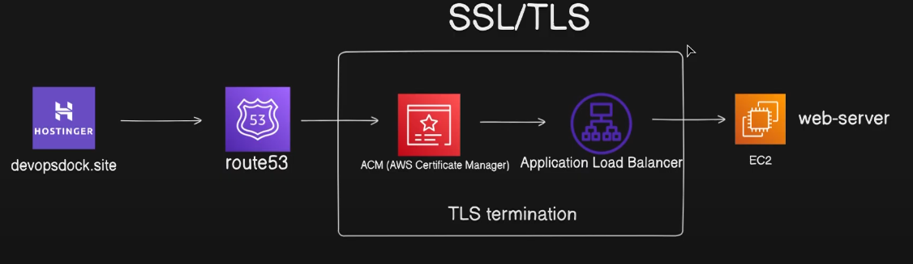

### 0.2 Set Up Load Balancer
- Create a **Load Balancer** (Application Load Balancer recommended).
- Create a **Listener** and add the EC2 instance into the **Target Group**.


load balancer 的 sg 配置 ，要不然，访问无法成功
ALB 安全组 (SG)

入站要允许：

TCP 80（HTTP）来源 0.0.0.0/0

TCP 443（HTTPS，如使用）来源 0.0.0.0/0

出站一般保持 All traffic 允许即可（默认是允许）。
### 0.3 Configure DNS in Route 53
- Create a **Public Hosted Zone** in **Route 53**.

hotst name. hostingger.


### 0.4 Update Domain Registrar
- Go to your **domain registrar** (e.g., Hostinger, GoDaddy).
- Copy the **nameservers** from Route 53 and update them in the registrar.
主要是得修改 nameserver
how the dns work 
top level domain, will tranct to autoriaztive server,  杠开始，我的 name server 是ogdaday,但是现在 autoraize server 是 route 53.现在告诉go daddy, when the request is coming, you dont need to hold it and rout the traffic to route 53.
然后你的brower就知道 server 的ip.
再 自己的 ec2上 运行  host devops.site 能看到 ip 所以序号change  nameserver
可以去 dsn checker 来查看 也可以使用nslookup 来查看

TLS TERmeation means the traffic will be encyped.
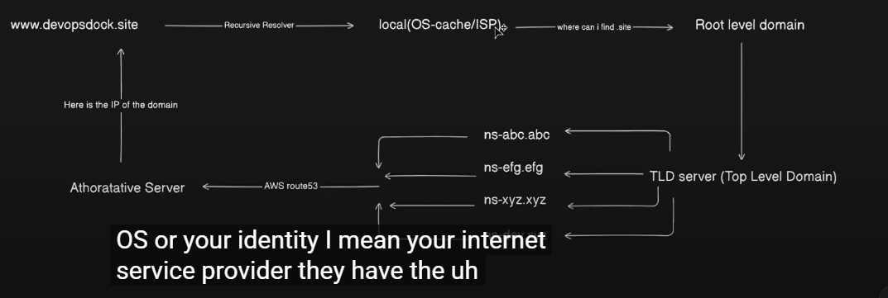

### 0.5 Wait for Propagation
- DNS propagation may take **12–48 hours**.

### 0.6 Request SSL/TLS Certificate
- Once DNS propagation is complete:
  - Go to **AWS Certificate Manager (ACM)**.
  - Request a **public certificate** for your domain.
  - Add the required CNAME record in **Route 53**.

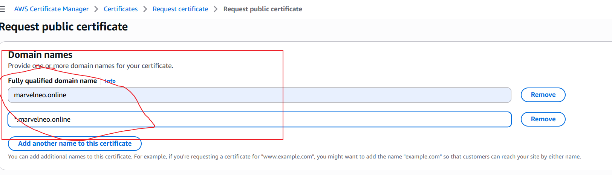
然后 点击createcords in route 53

### 0.7 Validate Certificate
- Wait for validation (usually **5–6 minutes**).
- The certificate will then be issued.

### 0.8 Configure HTTPS in Load Balancer
- Go to the **Load Balancer**.
- Create a new **HTTPS listener** or edit the existing listener to use the SSL certificate.

### 0.9 Update DNS Records
- In Route 53, create or edit an **A record / CNAME record** pointing your domain to the Load Balancer.

### 0.10 Access Your Website
- Open a browser and access your domain with:


1. **Clone the Repository:**
First, clone this repo to your local machine:<br/>
```bash
git clone https://github.com/LondheShubham153/tws-e-commerce-app.git
cd terraform
```
2. **Generate SSH Key Pair:**
Create a new SSH key to access your EC2 instance:
```bash
ssh-keygen -f terra-key
```
This will prompt you to create a new key file named terra-key.

3. **Private key permission:** Change your private key permission:
```bash
chmod 400 terra-key
```

4. **Initialize Terraform:**
Initialize the Terraform working directory to download required providers:
```bash
terraform init
```
5. **Review the Execution Plan:**
Before applying changes, always check the execution plan:
```bash
terraform plan
```
6. **Apply the Configuration:**
Now, apply the changes and create the infrastructure:
```bash
terraform apply
```
> Confirm with `yes` when prompted.

7. **Access Your EC2 Instance;** <br/>
After deployment, grab the public IP of your EC2 instance from the output or AWS Console, then connect using SSH:
```bash
ssh -i terra-key ubuntu@<public-ip>
```
8. **Update your kubeconfig:**
wherever you want to access your eks wheather it is yur local machine or bastion server this command will help you to interact with your eks.
> [!CAUTION]
> you need to configure aws cli first to execute this command:

```bash
aws configure
```

```bash
aws eks --region ap-southeast-2 update-kubeconfig --name tws-eks-cluster
```

只有vpc 内部的 bastion 可以access eks control plane
9. **Check your cluster:**
```bash
kubectl get nodes
```

## Jenkins Setup Steps
> [!TIP]
> Check if jenkins service is running:

```bash
sudo systemctl status jenkins
```
## Steps to Access Jenkins & Install Plugins

#### 1. **Open Jenkins in Browser:**
> Use your public IP with port 8080:
>**http://<public_IP>:8080**

#### 2. **Initial Admin password:**
> Start the service and get the Jenkins initial admin password:
> ```bash
> sudo cat /var/lib/jenkins/secrets/initialAdminPassword
> ```

#### 3. **Start Jenkins (*If Not Running*):**
> Get the Jenkins initial admin password:
> ```bash
> sudo systemctl enable jenkins
> sudo systemctl restart jenkins
> ```
#### 4. **Install Essential Plugins:**
> - Navigate to:
> **Manage Jenkins → Plugins → Available Plugins**<br/>
> - Search and install the following:<br/>
>   - **Docker Pipeline**<br/>
>   - **Pipeline View**


#### 5. **Set Up Docker & GitHub Credentials in Jenkins (Global Credentials)**<br/>
>
> - GitHub Credentials:
>   - Go to:
**Jenkins → Manage Jenkins → Credentials → (Global) → Add Credentials**
> - Use:
>   - Kind: **Username with password**
>   - ID: **github-credentials**<br/>


> - DockerHub Credentials:
> Go to the same Global Credentials section
> - Use:
>   - Kind: **Username with password**
>   - ID: **docker-hub-credentials**
> [Notes:]
> Use these IDs in your Jenkins pipeline for secure access to GitHub and DockerHub

#### 6. Jenkins Shared Library Setup:
> - `Configure Trusted Pipeline Library`:
>   - Go to:
> **Jenkins → Manage Jenkins → Configure System**
> Scroll to Global Pipeline Libraries section
>
> - **Add a New Shared Library:** 
> - **Name:** Shared
> - **Default Version:** main
> - **Project Repository URL:** `https://github.com/<your user-name/jenkins-shared-libraries`.
>
> [Notes:] 
> Make sure the repo contains a proper directory structure eq: vars/<br/>
	var 里面 的 repo和 docker 需要修改一下
#### 7. Setup Pipeline<br/>
> - Create New Pipeline Job<br/>
>   - **Name:** EasyShop<br/>
>   - **Type:** Pipeline<br/>
> Press `Okey`<br/>

> > In **General**<br/>
> > - **Description:** EasyShop<br/>
> > - **Check the box:** `GitHub project`<br/>
> > - **GitHub Repo URL:** `https://github.com/<your user-name/tws-e-commerce-app`<br/>
>
> > In **Trigger**<br/>
> > - **Check the box:**`GitHub hook trigger for GITScm polling`<br/>
>
> > In **Pipeline**<br/>
> > - **Definition:** `Pipeline script from SCM`<br/>
> > - **SCM:** `Git`<br/>
> > - **Repository URL:** `https://github.com/<your user-name/tws-e-commerce-app`<br/>
> > - **Credentials:** `github-credentials`<br/>
> > - **Branch:** master<br/>
> > - **Script Path:** `Jenkinsfile`<br/>

#### **Fork Required Repos**<br/>
> > Fork App Repo:<br/>
> > * Open the `Jenkinsfile`<br/>
> > * Change the DockerHub username to yours<br/>
>
> > **Fork Shared Library Repo:**<br/>
> > * Edit `vars/update_k8s_manifest.groovy`<br/>
> > * Update with your `DockerHub username`<br/>
> 
> > **Setup Webhook**<br/> 为什么要set up webhook? 需要研究一下
> > In GitHub:<br/>
> >  * Go to **`Settings` → `Webhooks`**<br/>
> >  * Add a new webhook pointing to your Jenkins URL<br/>
> >  * Select: **`GitHub hook trigger for GITScm polling`** in Jenkins job<br/>
>
> > **Trigger the Pipeline**<br/>
> > Click **`Build Now`** in Jenkins

#### **8. CD – Continuous Deployment Setup**<br/>
**Prerequisites:**<br/>
Before configuring CD, make sure the following tools are installed:<br/>
* Installations Required:<br/>
**kubectl**<br/>
**AWS CLI**

**SSH into Bastion Server**<br/>
* Connect to your Bastion EC2 instance via SSH.

**Note:**<br/>
This is not the node where Jenkins is running. This is the intermediate EC2 (Bastion Host) used for accessing private resources like your EKS cluster.

**8. Configure AWS CLI on Bastion Server**
Run the AWS configure command:<br/>
```bash
aws configure
```
Add your Access Key and Secret Key when prompted.

**9. Update Kubeconfig for EKS**<br/>
Run the following important command:
```bash
aws eks update-kubeconfig --region ap-southeast-2 --name tws-eks-cluster
```
* This command maps your EKS cluster with your Bastion server.
* It helps to communicate with EKS components.

**10. Install AWS application load balancer refering the below docs link**<br/>
```
https://docs.aws.amazon.com/eks/latest/userguide/lbc-helm.html


```

prerequsits,前提是需要安装很多 cnis 之类的
可以使用看 k get pods -n system
the controller watches for Kubernetes Ingress or Service resources. In response, it creates the appropriate AWS Elastic Load Balancing resources

he controller provisions the following resources:

  Kubernetes Ingress
  The LBC creates an AWS Application Load Balancer (ALB) when you create a Kubernetes Ingress. Review the annotations you can apply to an Ingress resource.

  Kubernetes service of the LoadBalancer type
  The LBC creates an AWS Network Load Balancer (NLB)when you create a Kubernetes service of type LoadBalancer. Review the annotations you can apply to a Service resource.
如果使用的是服务账户的 IAM 角色（IRSA），则必须为每个集群设置 IRSA，并且角色信任策略中的 OpenID Connect（OIDC）提供者 ARN 应特定于每个 EKS 集群


eksctl create iamserviceaccount \
    --cluster=tws-eks-cluster \
    --namespace=kube-system \
    --name=aws-load-balancer-controller \
    --attach-policy-arn=arn:aws:iam::277707141977:policy/AWSLoadBalancerControllerIAMPolicy \
    --override-existing-serviceaccounts \
    --region ap-southeast-2 \
    --approve

    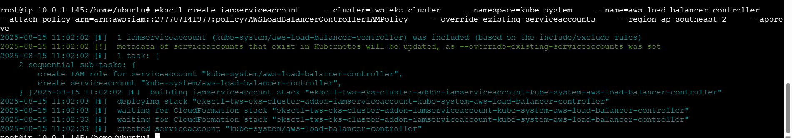
    implemeting the cloudformation to create the sa.role. ,去 conslole validate， 验证一下。 cloudformation。
    k get sa  aws-load-balncer-controler -n kube-system
    然后step 2 
通过helm 来安装alb controller
helm install aws-load-balancer-controller eks/aws-load-balancer-controller \
  -n kube-system \
  --set clusterName=tws-eks-cluster \
  --set serviceAccount.create=false \
  --set serviceAccount.name=aws-load-balancer-controller \
  --set region=ap-southeast-2
  --set vpcId=vpc-0f29bb76897c77a96
  --version 1.13.0
应该能看到 alb controller 
k  get sa -n kube-system 
k get deploymetn -n kube-system aws-load-balancer.

注意的是 The helm install command automatically installs the custom resource definitions (CRDs) for the controller. The helm upgrade command does no
kubectl get deployment -n kube-system aws-load-balancer-controller 命令
**11. Install the EBS CSI driver refering the below docs link**<br/>
same process as alb controler,  比较简单的是使用 eksctl 来安装。  然后去看cloudformation.
```
https://docs.aws.amazon.com/eks/latest/userguide/ebs-csi.html#eksctl_store_app_data
```
Amazon EBS volumes and the Amazon EBS CSI driver are not compatible with Amazon EKS Hybrid Nodes.

The Amazon EBS CSI plugin requires IAM permissions to make calls to AWS APIs on your behalf.

如果使用kms的话在 cis  安装的policy中添加。u do not use a custom KMS key. If y

1  新建一个 iam role

和  alb 类似。  然后去 helm  install csi driver
eksctl create iamserviceaccount \
        --name ebs-csi-controller-sa \
        --namespace kube-system \
        --cluster tws-eks-cluster \
        --role-name AmazonEKS_EBS_CSI_DriverRole \
        --role-only \
        --attach-policy-arn arn:aws:iam::aws:policy/service-role/AmazonEBSCSIDriverPolicy \
        --approve

不适用下面的如果没有kms
<!-- aws iam create-policy \
      --policy-name KMS_Key_For_Encryption_On_EBS_Policy \
      --policy-document file://kms-key-for-encryption-on-ebs.json

Attach the IAM policy to the role with the following command.
aws iam attach-role-policy \
      --policy-arn arn:aws:iam::111122223333:policy/KMS_Key_For_Encryption_On_EBS_Policy \
      --role-name AmazonEKS_EBS_CSI_DriverRole -->

step 2  use helm to depoy the driver . 也可以使用kustomize 
helm upgrade --install aws-ebs-csi-driver \
    --namespace kube-system \
    aws-ebs-csi-driver/aws-ebs-csi-driver
需要 k  get pods -n kube-system -l app.kubernetes.io/name=aws-cis-driver  w 来看信息


**12. Argo CD Setup**<br/>
Create a Namespace for Argo CD<br/>
```bash
kubectl create namespace argocd
```
1. Install Argo CD using helm  
(https://artifacthub.io/packages/helm/argo/argo-cd)


```bash
helm repo add argo https://argoproj.github.io/argo-helm
helm install my-argo-cd argo/argo-cd --version 8.2.7 -n argocd11
``
1， 为了access argocd，一个是去helm repo check the default values. 
一个是使用 ingress 或者 loadballncer 所以才需要配置 values
2. get the values file and save it ******
为什么是这个命令 helm show values argo/argo-cd 会显示 argo/argo-cd 这个 Helm Chart 的所有可配置参数
```bash
helm show values argo/argo-cd > argocd-values.yaml  
```
3. edit the values file, change the below settings.   为了foring exposing the argocd in ingress.

在 artifcat hub 页面中可以查看 如何配置 alb ingress
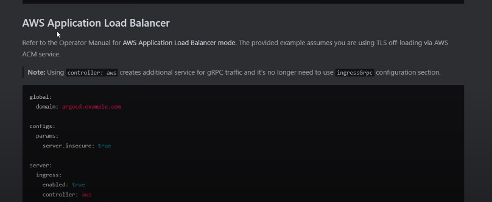
```
global:
  domain: argocd.example.com  搜索  ingress  前提是检测 argocd running or not。 k get po -n argocd  然后vi  set number 

configs:
  params:
    server.insecure: true
这里开启argo cd的 ingress 从 argo cd 官网的 aws loadbalancer中拷贝。 
https://argo-cd.readthedocs.io/en/stable/operat-or-manual/ingress/#aws-application-load-balancers-albs-and-classic-elb-http-mode
server:
  ingress:
    enabled: true # 这里开启argo cd的 ingress 从 argo cd 官网的 aws loadbalancer中拷贝。
    controller: aws  # 都是默认值。
    ingressClassName: alb  # ingressClassName
    annotations:
      alb.ingress.kubernetes.io/scheme: internet-facing 
      alb.ingress.kubernetes.io/certificate-arn: <your-cert-arn>  #ssl/tls certificat
      alb.ingress.kubernetes.io/group.name: easyshop-app-lb  # combine all the ingress resoure 到一个 group中，不需要创建多个 alb
      alb.ingress.kubernetes.io/target-type: ip 或者 instance #不适用nodeport，需要修改wei clster ip 也就是ip   会把tfraffic  forward 到一个 target group. 也就是 POD  ip 也就是 targetgroup里面的pod 的IP.  traget-type 是 ip address。 不是instance ip.
      alb.ingress.kubernetes.io/backend-protocol: HTTP
      alb.ingress.kubernetes.io/listen-ports: '[{"HTTP":80}, {"HTTPS":443}]'
      alb.ingress.kubernetes.io/ssl-redirect: '443'  if the traffic from http, it will be redirect to https 
    hostname: argocd.devopsdock.site   # hostname 就是一个subdomomin
    aws:
      serviceType: ClusterIP # <- Used with target-type: ip  
      backendProtocolVersion: GRPC
搜索  alb ingress annataions 能看到下面的 关于 group
Security Risk

IngressGroup feature should only be used when all Kubernetes users with RBAC permission to create/modify Ingress resources are within trust boundary.

If you turn your Ingress to belong a "explicit IngressGroup" by adding group.name annotation, other Kubernetes user may create/modify their Ingresses to belong same IngressGroup, thus can add more rules or overwrite existing rules with higher priority to the ALB for your Ingress.

We'll add more fine-grained access-control in future versions. 

    使用vim  技巧   set number 和 /来搜索。 alias k=kubectl 
    
```
4. save and upgrade the helm chart.
```
helm upgrade my-argo-cd argo/argo-cd -n argocd -f my-values.yaml

k get ingress argocd
这时候会创建一个 loadbalancer.
listern rules， 会把tfraffic  forward 到一个 target group. 也就是 port iip.  traget-type 是 ip address。 不是instance ip.
k get po -n argocd -o wide，
我们能看到 这里面的 argocd server pod ip 就是前面的 target ips.
 一个是grpc 一个是 http 看这里的listener rule。 这个rule 就是
 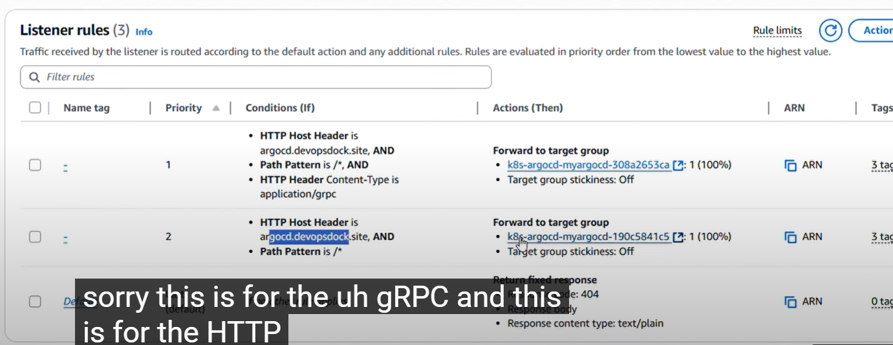


这里面的 target group 就是  pod  argocd server 的ip
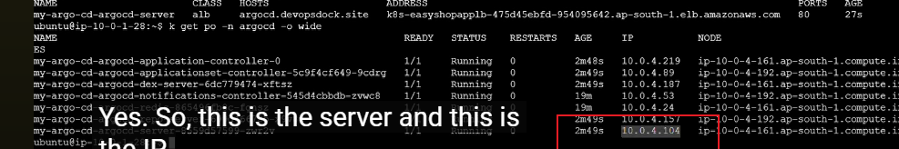
```
5. add the record in route53 “argocd.devopsdock.site” with load balancer dns.

record type 使用a reocrd， 然后  alias 。。 选择 loadbalancer":  a rcord alias


A 记录（Address Record）

作用：将域名直接解析到一个 IPv4 地址。
场景：将 example.com 解析到 EC2、ELB、ALB 的公网 IP。
示例：easyshop.devopsdock.site → 1.2.3.4
CNAME 记录（Canonical Name Record）

作用：将一个域名指向另一个域名（不能用于根域名）。
场景：www.example.com → example.com，或指向 CloudFront/ELB DNS 名称。
示例：www.easyshop.devopsdock.site → easyshop.devopsdock.site
Alias 记录（AWS 特有）

作用：将域名直接指向 AWS 资源（如 ALB、CloudFront、S3 静态网站），不消耗 DNS 查询次数。
场景：根域名指向 ALB/CloudFront。
示例：easyshop.devopsdock.site → my-alb-1234567890.us-west-2.elb.amazonaws.com

6. access it in browser.

7. Retrive the secret for Argocd

```jsx
kubectl -n argocd get secret argocd-initial-admin-secret -o jsonpath="{.data.password}" | base64 -d
```

8. login to argocd “admin” and retrieved password

9. Change the password by going to “user info” tab in the UI.

**Deploy Your Application in Argo CD GUI**

> On the Argo CD homepage, click on the “New App” button.
>

> Fill in the following details:
> 
> - **Application Name:** `Enter your desired app name`
> - **Project Name:** Select `default` from the dropdown.
> - **Sync Policy:** Choose `Automatic`.

> In the Source section:
> 
> - **Repo URL:** Add the Git repository URL that contains your Kubernetes manifests. 
> - **Path:** `Kubernetes` (or the actual path inside the repo where your manifests reside) 主要是manifest files
argo cd 会自动pick up the manifest file of the k8s
> In the “Destination” section:
> 
> - **Cluster URL:** [https://kubernetes.default.svc](https://kubernetes.default.svc/) (usually shown as "default") 
> - **Namespace:** tws-e-commerce-app (or your desired namespace)
 然后就能看到
> Click on “Create”.
> argo CD 的 “New App” 是指在 Argo CD 中创建一个新的应用（Application）对象。它的核心概念如下：

Application 是 Argo CD 的核心资源，代表你要在 Kubernetes 集群中持续部署和管理的一个应用。
每个 Application 会绑定一个 Git 仓库（或 Helm 仓库）和一个目标集群/命名空间，Argo CD 会自动同步仓库中的 K8s 配置到集群。
主要配置项：

Application Name：应用的唯一名称。
Project：归属的 Argo CD 项目（可用于权限隔离）。
Sync Policy：同步策略（手动/自动）。
Source：代码仓库地址、分支、路径（K8s manifests/Helm chart 所在目录）。
Destination：目标集群和命名空间。
Revision：要部署的 Git 分支、tag 或 commit。
作用：

让 GitOps 自动化落地，代码变更自动触发集群变更。
可视化管理、回滚、对比、审计应用的所有变更。
简单说，New App 就是把你的 Git 仓库和 K8s 集群“绑定”起来，实现持续部署和声明式管理。

NOTE: before deploying Chnage your ingress settings and image tag in the yamls inside “kubernetes” directory

Ingress Annotations: 

```jsx
annotations:
    alb.ingress.kubernetes.io/group.name: easyshop-app-lb
    alb.ingress.kubernetes.io/scheme: internet-facing
    alb.ingress.kubernetes.io/certificate-arn: arn:aws:acm:ap-southeast-2:876997124628:certificate/b69bb6e7-cbd1-490b-b765-27574080f48c
    alb.ingress.kubernetes.io/target-type: ip
    alb.ingress.kubernetes.io/backend-protocol: HTTP
    alb.ingress.kubernetes.io/listen-ports: '[{"HTTP":80}, {"HTTPS":443}]'
    alb.ingress.kubernetes.io/ssl-redirect: '443'
    kubernetes.io/ingress.class: alb
```

- **add record to route 53 “easyshop.devopsdock.site”** 这次可以使用cname.

- **Access your site now.**

### Install Metric Server

- metric server install thru helm chart
 is a scalable, efficient source of container resource metrics for Kubernetes built-in autoscaling pipelines.
```
https://artifacthub.io/packages/helm/metrics-server/metrics-server
```
verify metric server.
```
kubectl get pods -w
kubectl top pods 能看到 metrics cupu of the node.
```
### Monitoring Using kube-prometheus-stack 这是一个 operator还是 helm?
de easy to operate end-to-end Kubernetes cluster monitoring with  using the . 
里面有inbuild prometheus rules . 
kube-prometheus-stack 既是一个 Helm Chart，也是一个 Operator 方案。它通过 Helm Chart 安装，但核心组件（如 Prometheus Operator）负责自动化管理和自愈 Prometheus、Alertmanager、Grafana 等监控资源。

区别如下：

传统 Helm Chart（如单独的 prometheus、grafana）只是简单部署应用，后续资源（如 ServiceMonitor、Rule、Alert）需要手动管理。
kube-prometheus-stack 通过 Helm 安装 Prometheus Operator，Operator 会自动发现、管理和自愈监控相关的自定义资源（如 ServiceMonitor、PrometheusRule），实现声明式和自动化运维。
create a namespace “monitoring”

```jsx
kubectl create ns monitoring
```
```
https://artifacthub.io/packages/helm/prometheus-community/kube-prometheus-stack
```
verify deployment :

```jsx
kubectl get pods -n monitoring
```

get the helm values and save it in a file

```jsx  这个很重要
helm show values prometheus-community/kube-prometheus-stack > kube-prom-stack.yaml 
```

edit the file and add the following in the params for prometheus, grafana and alert manger.
修改每一个的ingress part.  
需要搜索default values 在 helm install 解密中 搜索  alertmanger.ingress
**Grafana:**

```jsx
ingressClassName: alb  # k get ingressclass. controle name 是alb当我们安装loagbalncer controller的时候会自动安装 ingress class name
annotations:
      alb.ingress.kubernetes.io/group.name: easyshop-app-lb
      alb.ingress.kubernetes.io/scheme: internet-facing
      alb.ingress.kubernetes.io/certificate-arn: arn:aws:acm:ap-southeast-2:876997124628:certificate/b69bb6e7-cbd1-490b-b765-27574080f48c
      alb.ingress.kubernetes.io/target-type: ip
			alb.ingress.kubernetes.io/listen-ports: '[{"HTTP":80}, {"HTTPS":443}]'
      alb.ingress.kubernetes.io/ssl-redirect: '443'
 
    hosts:
      - grafana.devopsdock.site
```

**Prometheus:** 
可以直接/ prometheus.domain.name
```jsx
ingressClassName: alb
annotations:
      alb.ingress.kubernetes.io/group.name: easyshop-app-lb
      alb.ingress.kubernetes.io/scheme: internet-facing
      alb.ingress.kubernetes.io/certificate-arn: arn:aws:acm:ap-southeast-2:876997124628:certificate/b69bb6e7-cbd1-490b-b765-27574080f48c
      alb.ingress.kubernetes.io/target-type: ip
      alb.ingress.kubernetes.io/listen-ports: '[{"HTTP":80}, {"HTTPS":443}]'
      alb.ingress.kubernetes.io/ssl-redirect: '443'
    labels: {}

    然后要给 host name
  
    hosts: 
      - prometheus.devopsdock.site
        paths:
        - /
        pathType: Prefix  path typ： 不要忘记这个是 Prefix   也可以是exact?


```
在 Kubernetes Ingress 里，pathType 有三种常用类型：Prefix、Exact、和 ImplementationSpecific。你问的 Prefix 和 Exact 区别如下：

pathType: Prefix

匹配所有以指定路径开头的请求。例如，path: / 结合 Prefix，会匹配 /、/foo、/bar/baz 等所有路径。
适合大多数 Web 应用，尤其是你想让所有子路径都路由到同一个服务时。
例子：path: /api，pathType: Prefix，会匹配 /api、/api/v1、/api/foo 等。
**Alertmanger:**
```jsx
ingressClassName: alb
annotations:
      alb.ingress.kubernetes.io/group.name: easyshop-app-lb
      alb.ingress.kubernetes.io/scheme: internet-facing
      alb.ingress.kubernetes.io/target-type: ip
      alb.ingress.kubernetes.io/backend-protocol: HTTP
			alb.ingress.kubernetes.io/listen-ports: '[{"HTTP":80}, {"HTTPS":443}]'
      alb.ingress.kubernetes.io/ssl-redirect: '443'
    
    hosts: 
      - alertmanager.devopsdock.site
    paths:
    - /
    pathType: Prefix
```


helm upgrade my-kube-prometheus-stack prometheus-community/kube-prometheus-stack -f kube-prom-stack.yaml -n monitoring
x需要 upgrade   yml file.
k get ingress -n moitoring.
能看到 三个 。 ingress class 为 alb的  ingress.
grafana, prometheus, alert manager.
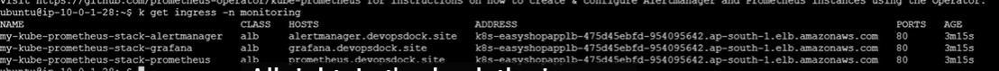
能看到更新的rule,然后再去 route 53. add the record 所有的hostname CNAME 到 alb 的value
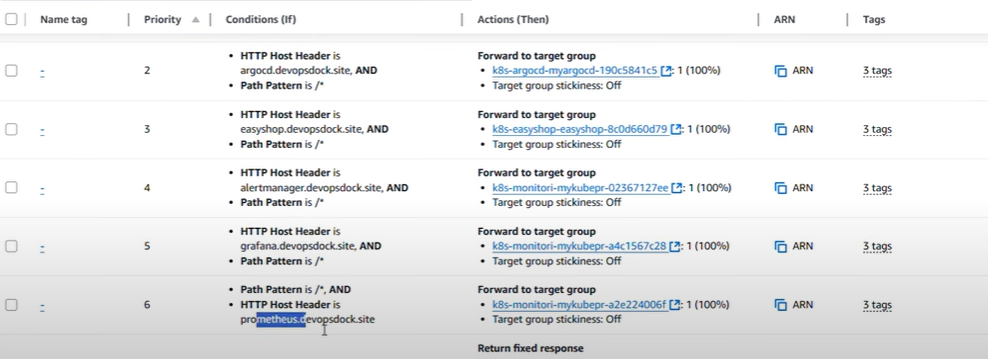


能看到  mdashboard的 默认值。 grafana - dashboard.  默认的 built-in的rules包含其他的。
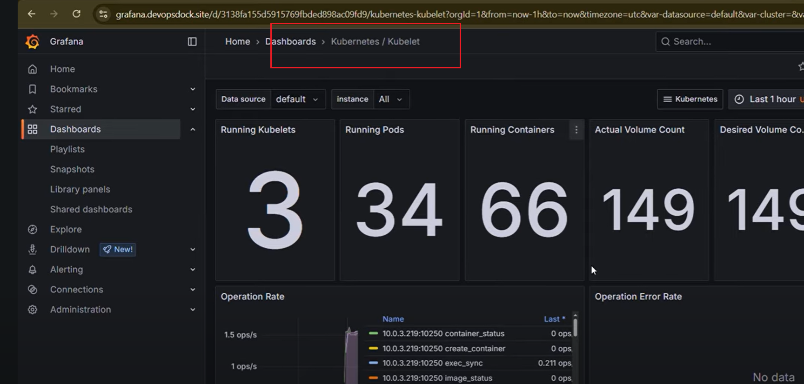
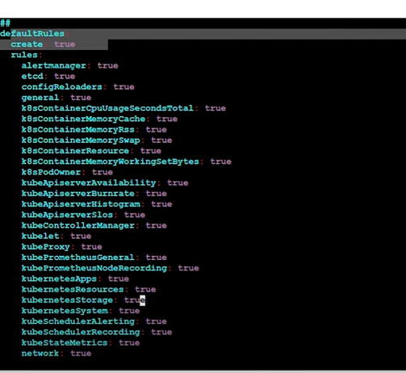
modify the helm values.
**Alerting to Slack** 
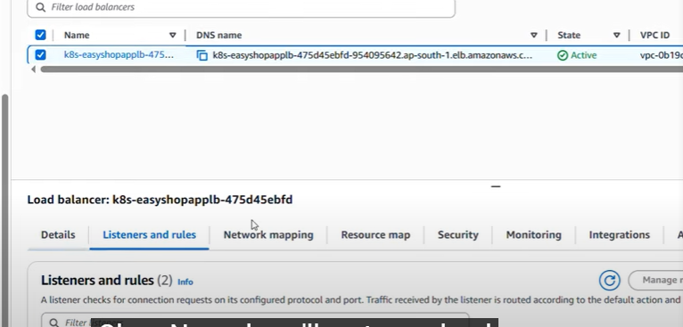
Create a new workspace in slack, create a new channel e.g. “#alerts” 创建一个新的workspace和 new channel

go to https://api.slack.com/apps to create the webhook.
create a new app 类似 azure 中的  apps 。。
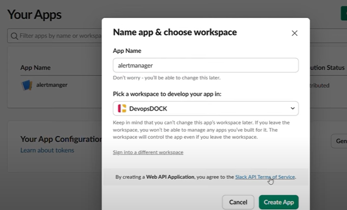
1. create an app “alertmanager”
2. go to incoming webhook
3. create a webhook and copy it.  chouse the channle 你想post的
拷贝这个webhook
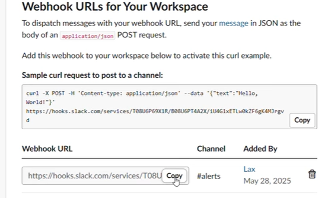

又得去 alartmanager confg in the  yml.得到的结果如下
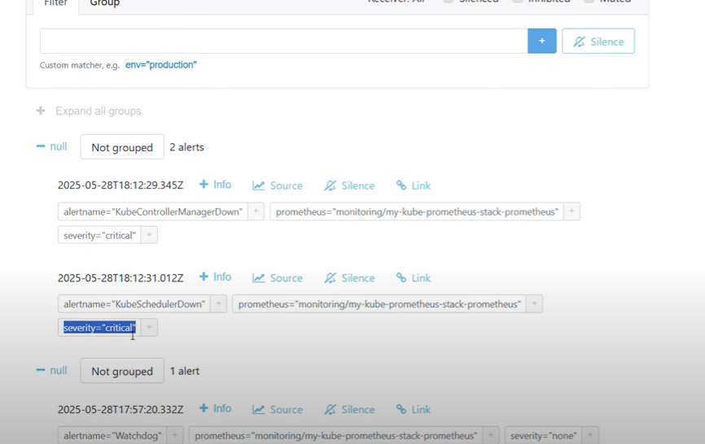
```jsx
config:
    global:
      resolve_timeout: 5m
    route:
      group_by: ['namespace']
      group_wait: 30s
      group_interval: 5m
      repeat_interval: 12h
      receiver: 'slack-notification'
      routes:
      - receiver: 'slack-notification'
        matchers:
          - severity = "critical" # 这个是在 alert yaml rule中定义的。 有example rules.
    receivers:
    - name: 'slack-notification'
      slack_configs:
          - api_url: 'https://hooks.slack.com/services/T08ULBZB5UY/B08U0CE3DEG/OivCLYq28gNzz4TabiY5zUj'
            channel: '#alerts'
            send_resolved: true
    templates:
    - '/etc/alertmanager/config/*.tmpl'
```
route: 告警路由规则，决定告警如何分组、延迟、发送到哪个 receiver
group_by: 按哪些标签分组
group_wait: 第一次分组等待时间
group_interval: 同组告警再次发送的间隔
repeat_interval: 重复发送的间隔
receiver: 默认接收器
routes: 子路由，按条件（如 severity）进一步分流
receivers: 告警接收器配置，这里配置了 Slack 通知
slack_configs: Slack Webhook 地址、频道、是否发送已恢复通知等
templates: 自定义告警消息模板路径
Note: you can refer this DOCs for the slack configuration. “https://prometheus.io/docs/alerting/latest/configuration/#slack_config” 

upgrade the chart

```jsx
helm upgrade my-kube-prometheus-stack prometheus-community/kube-prometheus-stack -f kube-prom-stack.yaml -n monitoring
```

get grafana secret “user = admin”

```jsx
kubectl --namespace monitoring get secrets my-kube-prometheus-stack-grafana -o jsonpath="{.data.admin-password}" | base64 -d ; echo
```

You would get the notification in the slack’s respective channel.

## **Logging**

- we will use elasticsearch for logsstore, filebeat for log shipping and kibana for the visualization.
我们需要创建一个 persisit volume， t

```
NOTE: The EBS driver we installed is for elasticsearch to dynamically provision an EBS volume.
```
**Install Elastic Search:**

```jsx
helm repo add elastic https://helm.elastic.co -n logging
helm install my-elasticsearch elastic/elasticsearch --version 8.5.1 -n logging
```
k  get po -n lggging 会发现有pending 

lets search  default vlause    volumClaimTemplate.   需要talk to storage class.

****重要Create a storageclass so that elastic search can dynamically provision volume in AWS.

storageclass.yaml

```jsx
apiVersion: storage.k8s.io/v1
kind: StorageClass
metadata:
  name: ebs-aws
  annotations:
    storageclass.kubernetes.io/is-default-class: "true"
provisioner: ebs.csi.aws.com
reclaimPolicy: Delete
volumeBindingMode: WaitForFirstConsumer
```

apply the yaml file.

get the values for elastic search helm chart.

```jsx
helm show values elastic/elasticsearch > elasticsearch.yaml 
```

update the values

```jsx
replicas: 1  # 一般 1个 master  2个  data.  minimumasternode:1  replicas: 1都设置为1
minimumMasterNodes: 1
clusterHealthCheckParams: "wait_for_status=yellow&timeout=1s"
```

这些设置是为了让 Elasticsearch 在单节点（开发/测试环境）下能正常启动和工作：

replicas: 1：只启动一个 Elasticsearch 实例（Pod），即单节点模式。
minimumMasterNodes: 1：主节点数量设为 1，避免集群启动时因缺少主节点而报错。
clusterHealthCheckParams: "wait_for_status=yellow&timeout=1s"：
yellow 状态表示主分片分配完成，但副本分片未分配（单节点无法分配副本）。
在单节点情况下，集群健康只能达到 yellow（不是 green），但可以正常读写数据。
这样设置可以让 Helm/Operator 检查到 yellow 就认为集群健康，避免因副本未分配导致安装/升级失败。
如果你是生产环境，建议至少 3 个节点，minimumMasterNodes 设置为 2 或 3，健康检查要求 green。但开发/测试环境单节点只能是 yellow。

upgrade the chart

```jsx
helm upgrade my-elasticsearch elastic/elasticsearch -f elasticsearch.yaml -n logging
```

if upgarde doesnt happen then uninstall and install it again.

make sure the pod is running .

```jsx
kubectl get po -n logging
NAME                     READY   STATUS    RESTARTS   AGE
elastic-operator-0       1/1     Running   0          6h33m
elasticsearch-master-0   1/1     Running   0          87m
```
k  get statefulset -n logging   有一个master
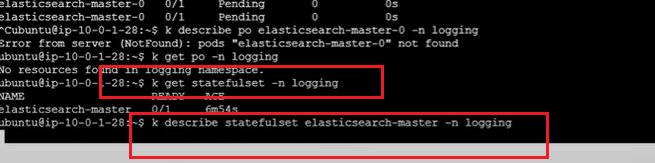
**FileBeat:**

Elasticsearch 需要持久化存储（数据不能因 Pod 重启而丢失），StatefulSet 支持挂载 PersistentVolume。
每个 Elasticsearch 节点（Pod）有唯一的名字和身份（如 elasticsearch-master-0），方便集群发现和主从选举。
StatefulSet 能保证 Pod 顺序启动、稳定的网络标识（DNS），适合分布式数据库。
这里 需要check  pv  pvc  

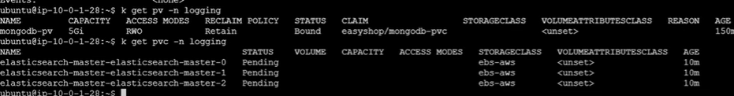
因为 statefulset to PVC will not delete, we have to delete it manually.
k  delete pvc  e-master-e-master-0     master-1 master-2


在 Kubernetes 里，StatefulSet 会为每个 Pod 自动创建一个 PersistentVolumeClaim（PVC），用于挂载持久化存储（PV）。比如 elasticsearch-master-0 会有一个名为 elasticsearch-master-elasticsearch-master-0 的 PVC。

当你删除 StatefulSet 或 Pod 时，这些 PVC 不会自动删除（防止误删数据），需要你手动删除。
kubectl delete pvc elasticsearch-master-elasticsearch-master-0 就是手动删除这个 PVC。
如果你有多个节点（如 master-1、master-2），也要分别删除对应的 PVC。
PVC pending 通常是因为没有合适的 StorageClass 或 PV 可用。手动删除 PVC 可以释放存储资源，避免遗留无用的磁盘。


需要去看 最早的 csi driver 。 。
   

   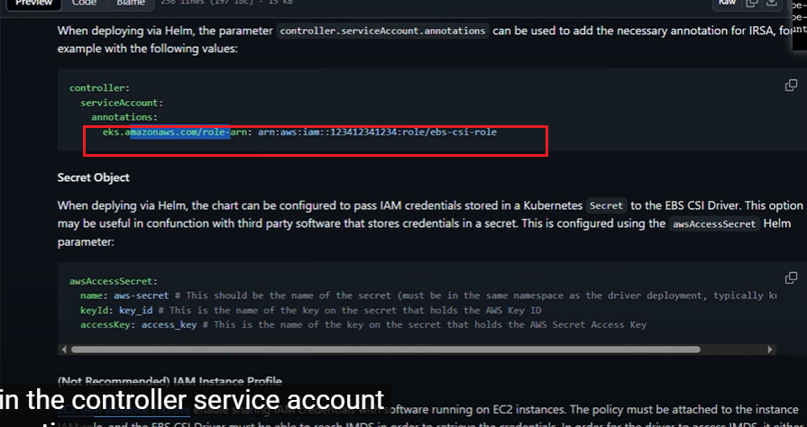
   没有role

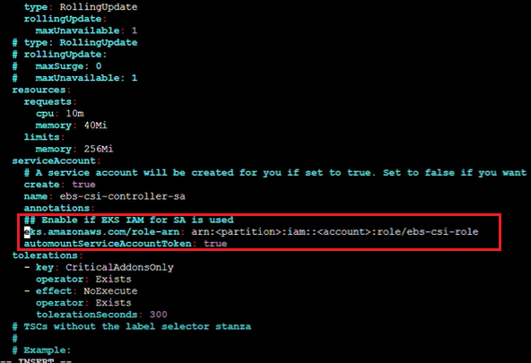

uninstall and  install it again!!!!!!!!!!
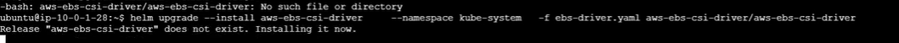

然后 grep  role 
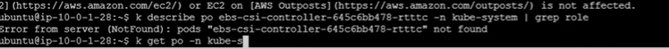

然后能看到这个volume 
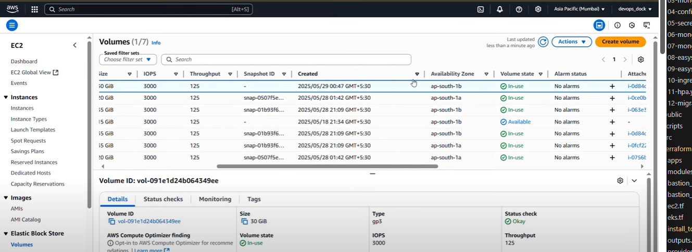
install filebeat for log shipping.

```jsx
helm repo add elastic https://helm.elastic.co
helm install my-filebeat elastic/filebeat --version 8.5.1 -n logging
```

get the values

```jsx
helm show values elastic/filebeat > filebeat.yaml 
```

Filebeat runs as a daemonset. check if its up.

```jsx
filebeat 一般是 dameaon set， 
kubectl get po -n logging
NAME                         READY   STATUS    RESTARTS   AGE
elastic-operator-0           1/1     Running   0          6h38m
elasticsearch-master-0       1/1     Running   0          93m
my-filebeat-filebeat-g79qs   1/1     Running   0          25s
my-filebeat-filebeat-kh8mj   1/1     Running   0          25s
```

**Install Kibana:**

install kibana through helm.

```jsx
helm repo add elastic https://helm.elastic.co
helm install my-kibana elastic/kibana --version 8.5.1 -n logging
```

Verify if it runs.

```jsx
k get po -n logging
NAME                               READY   STATUS    RESTARTS       AGE
elastic-operator-0                 1/1     Running   0              8h
elasticsearch-master-0             1/1     Running   0              3h50m
my-filebeat-filebeat-g79qs         1/1     Running   0              138m
my-filebeat-filebeat-jz42x         1/1     Running   0              108m
my-filebeat-filebeat-kh8mj         1/1     Running   1 (137m ago)   138m
my-kibana-kibana-559f75574-9s4xk   1/1     Running   0              130m
```

get values

```jsx
helm show values elastic/kibana > kibana.yaml 
```

modify the values for ingress settings

```jsx
ingress:
  enabled: true
  className: "alb"
  pathtype: Prefix
  annotations:
    alb.ingress.kubernetes.io/group.name: easyshop-app-lb
    alb.ingress.kubernetes.io/scheme: internet-facing
    alb.ingress.kubernetes.io/target-type: ip
    alb.ingress.kubernetes.io/backend-protocol: HTTP
    alb.ingress.kubernetes.io/certificate-arn: arn:aws:acm:ap-southeast-2:876997124628:certificate/b69bb6e7-cbd1-490b-b765-27574080f48c
    alb.ingress.kubernetes.io/listen-ports: '[{"HTTP":80}, {"HTTPS":443}]'
    alb.ingress.kubernetes.io/ssl-redirect: '443'
  # kubernetes.io/ingress.class: nginx
  # kubernetes.io/tls-acme: "true"
  hosts:
    - host: logs-kibana.devopsdock.site
      paths:
        - path: /
```

save the file and exit. upgrade the helm chart using the values file.

```jsx
helm upgrade my-kibana elastic/kibana -f kibana.yaml -n logging
```

add all the records to route 53 and give the value as load balancer DNS name. and try to access one by one. 
 
retrive the secret of elastic search as kibana’s password, username is “elastic”

```jsx
kubectl get secrets --namespace=logging elasticsearch-master-credentials -ojsonpath='{.data.password}' | base64 -d
```
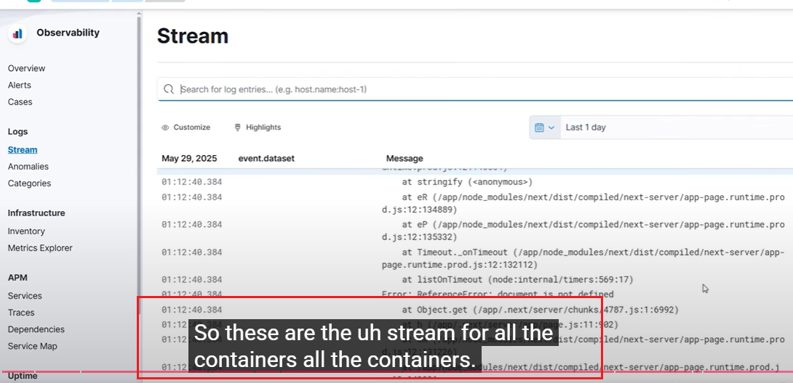

能看到 所有conatiner 的  stream 。
### **Filebeat Configuration to ship the "easyshop" app logs to elasticsearch**

configure filebeat to ship the application logs to view in kibana

```jsx
filebeatConfig:
    filebeat.yml: |
      filebeat.inputs:
      - type: container
        paths:
          - /var/log/containers/*easyshop*.log  原来是 *.log
          instaead of fecting all the logs, just  fetch the easyshop log， using the wild card 通配符。
```

upgrade filebeat helm chart and check in kibana’s UI if the app logs are streaming.

## **Congratulations!** <br/>


---

### 📌 Architecture Diagram
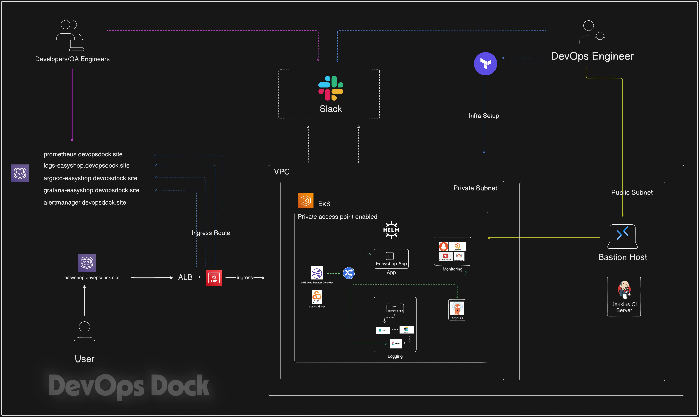

---

### 📌 ArgoCD
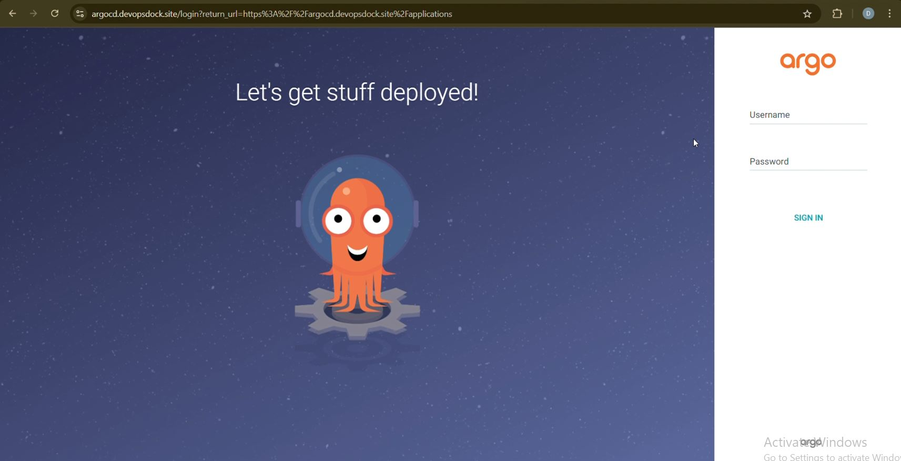

---

### 📌 Capture
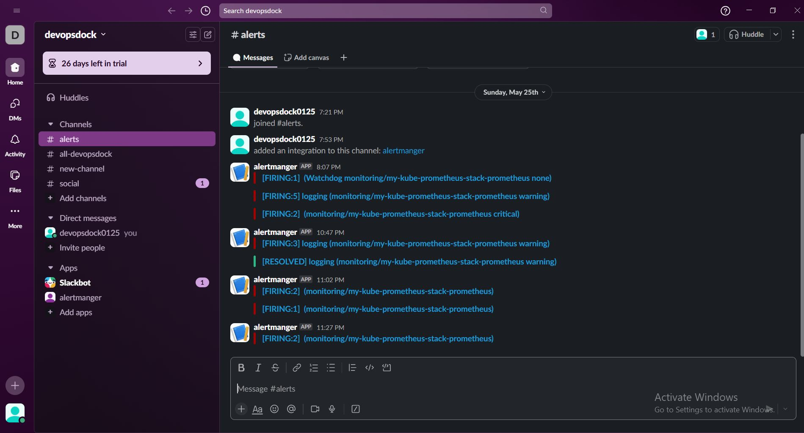

---

### 📌 AlertManager
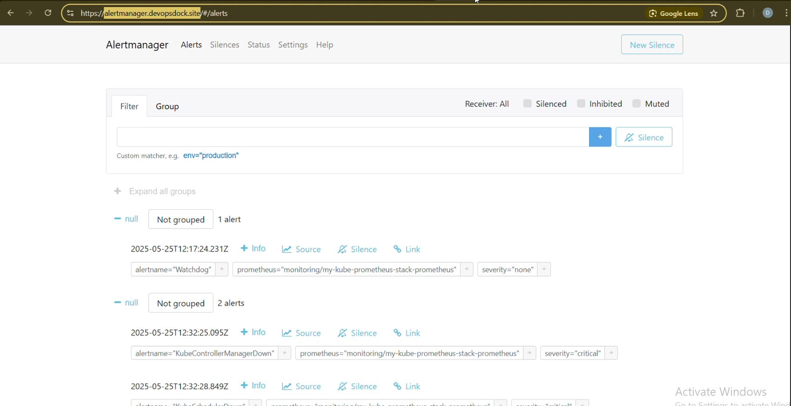


---

### 📌 Grafana Dashboard
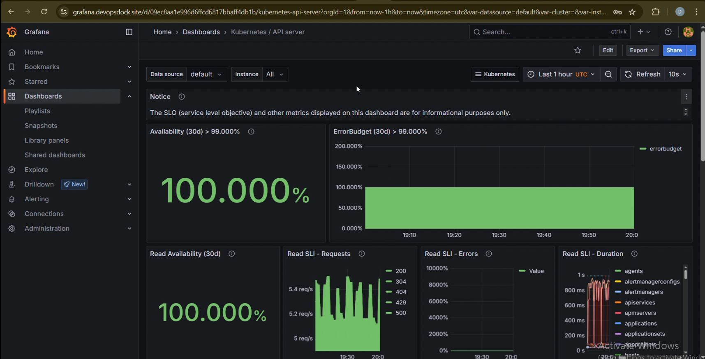

---

### 📌 Kibana Logs View


---

### 📌 Prometheus Dashboard
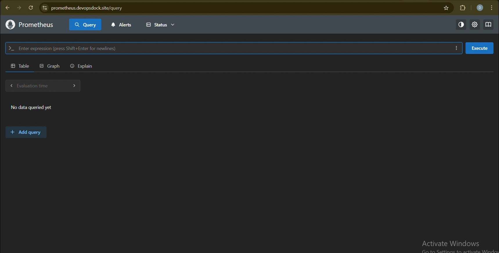

### WO! ooo!!! ...Your project is now deployed.
